<!--
  Diana Pinzón Reyes — GitHub profile README ("Nature distilled" design, September 2026)
  Marketing Automation Specialist · Co-founder & Automation and Growth Lead at Vulcano
  Keywords: marketing automation, workflow automation, n8n, Zapier, GoHighLevel, HubSpot,
  lead generation, cold email outreach, CRM operations, WhatsApp flows, Webflow, React, Astro,
  copywriting, psychology, Colombia, remote, bilingual ES/EN.
  Portfolio: https://portfoliodiana.netlify.app · LinkedIn: https://linkedin.com/in/dianapinzonreyes
  Assets are generated by scripts/build_assets.py.
-->

 

Tunja, Colombia · remote · Spanish and English

<h2></h2>

Most teams don't have a people problem; they have a hand-off problem. Leads arrive in one tool, live in another, and someone re-types them into a third. This is the path I design, build and document so that stops happening:

| Step | What happens | Tools |
|---|---|---|
| **1 · Capture** | Every lead lands in one place, with its source, and is assigned on arrival. | Web forms · Webflow · Meta Ads · WhatsApp |
| **2 · Orchestrate** | A workflow moves the data between tools instead of a person. | n8n · Zapier · webhooks · REST APIs |
| **3 · Nurture** | Follow-ups, WhatsApp flows and sequences fire from what the lead actually does. | GoHighLevel · HubSpot · SalesHandy · Instantly |
| **4 · Measure** | Dashboards show what sells, fed automatically instead of rebuilt every Monday. | n8n → dashboards · Power BI · SQL |

And step 4 feeds step 1: what converted this month decides who gets targeted next month.

<h2></h2>

<table>
<tr>
<td width="50%" valign="top">

**Marketing & sales automation** 
<i>No lead goes unanswered.</i>

Workflows in n8n, Zapier, GoHighLevel and HubSpot: CRM pipelines, follow-ups, reminders and WhatsApp conversations with a human hand-off.

</td>
<td width="50%" valign="top">

**Prospecting & cold outreach** 
<i>Conversations with prospects who actually fit you.</i>

Lists with Apollo and LinkedIn Sales Navigator, personalized sequences with SalesHandy and Instantly, segmentation by type of client.

</td>
</tr>
<tr>
<td width="50%" valign="top">

**Websites & landing pages that capture** 
<i>Every interested visitor reaches the CRM with their source.</i>

Landing pages and funnels in Webflow; internal apps and dashboards with React, Astro and Vite; forms and event tracking.

</td>
<td width="50%" valign="top">

**Content, copy & personal branding** 
<i>Messages people read and answer.</i>

Positioning on LinkedIn, automated newsletters and consumer-psychology-driven messaging with a consistent brand voice.

</td>
</tr>
</table>

<h2></h2>

<table>
<tr>
<td width="50%" valign="top">

#### OMW operations dashboard

Costs, clients, appointments and the sales pipeline in one place for On My Way. n8n pulls and consolidates the GoHighLevel CRM data, so nobody rebuilds a report by hand.

`n8n` `GoHighLevel` `React` `REST APIs`

</td>
<td width="50%" valign="top">

#### WhatsApp customer-service bot

Answers at any hour, transcribes voice notes and hands the conversation to a person when needed. EvolutionAPI, self-hosted n8n, Redis and OpenAI.

`n8n` `EvolutionAPI` `Redis` `OpenAI`

</td>
</tr>
<tr>
<td width="50%" valign="top">

#### Prospecting pipeline for CFOPro

n8n workflows connecting the CRM (ClickUp), Apollo, LinkedIn Sales Navigator and SalesHandy, removing the manual steps between finding a lead and writing to them.

`n8n` `ClickUp` `Apollo` `SalesHandy`

</td>
<td width="50%" valign="top">

#### [Portfolio site](https://portfoliodiana.netlify.app)

Bilingual ES/EN, one page that tells the client story with a live funnel hero, case studies, structured data and SEO metadata.

`React` `Vite` `Tailwind` `framer-motion` `GSAP`

</td>
</tr>
</table>

Case studies with screenshots on the <a href="https://portfoliodiana.netlify.app/projects">portfolio →</a>

<h2></h2>

<h2></h2>

<table>
<tr>
<td width="110" align="center" valign="middle">

</td>
<td valign="middle">

**[Vulcano](https://vulcanoservices.dev) · Co-founder, Automation & Growth** 2026 – present 
A software, data and process-automation engineering studio I co-founded with [Gabriel Castillo](https://github.com/gabo8191). I lead automation and growth: workflow design, lead generation, CRM operations and content strategy.

</td>
</tr>
</table>

- **On My Way · Marketing Automation Specialist** Apr. 2026 – present 
  WhatsApp conversation flows that qualify, route and follow up on enquiries; documented GoHighLevel automations; Webflow campaign pages; webinars and lead capture with Jotform and Wistia.
- **CFOPro LLC · Virtual Assistant & Automation Support** May 2025 – Mar. 2026 
  n8n workflows across ClickUp, Apollo, LinkedIn Sales Navigator and SalesHandy; internal apps with React, Astro and Vite; automated LinkedIn outreach, cold email and newsletters.
- **Independent · Copywriting & personal branding** 2024 – 2025 
  Personal-branding and communication strategies for technology professionals, with automated content workflows.
- **Clinical and Health Research Group · Research Lead** Jun. 2024 – present 
  Leads a study on the impact of social media on adolescent social skills, with statistical analysis and research automation on large datasets.

<h2></h2>

I'm studying **Psychology at UPTC** (in progress) and lead research in a clinical and health research group, working with statistics, psychometrics and large datasets. That path is the point: most automation fails not because the workflow is wrong, but because nobody on the team wants to use it. I design for how people actually behave, then measure whether it moved a metric that matters.

 

  

