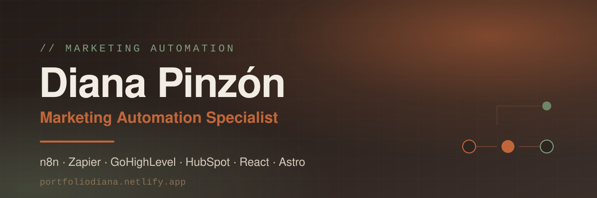

<!--
  Diana Pinzón Reyes — GitHub profile README
  Marketing Automation Specialist · Co-founder & Automation and Growth Lead at Vulcano
  Keywords: marketing automation, workflow automation, n8n, Zapier, GoHighLevel, HubSpot,
  lead generation, cold email outreach, CRM operations, RevOps, growth operations,
  web development, React, Astro, Webflow, copywriting, Colombia, remote, bilingual ES/EN.
  Portfolio: https://portfoliodiana.netlify.app · LinkedIn: https://linkedin.com/in/dianapinzonreyes
-->

  

# Diana Pinzón

### <samp>I build the machine that does the repetitive work, so people can do the work that needs a person.</samp>

-7FA07F?style=flat-square&labelColor=3B2F2A)

---

## &nbsp; The system I build

<samp>Most teams don't have a people problem — they have a handoff problem. Leads arrive in one tool, live in another, and someone re-types them into a third. This is the pipeline I design, build and maintain so that stops happening:</samp>

 &nbsp;**Every lead lands in one place, enriched and assigned on arrival.**

   

 &nbsp;**The flow that moves data between tools — with retries, logging and no surprises.**

   

 &nbsp;**Pipelines, follow-ups and nurturing triggered by what the lead actually does.**

   

 &nbsp;**The numbers are live, not reconstructed by hand every Monday.**

  

<samp>And step 4 feeds step 1 back: what converted this month decides who gets targeted next month.</samp>

---

## &nbsp; What changes when it's automated

<samp>The honest version of what that means day to day, from work I've shipped:</samp>

| | ❌ &nbsp;Before | ✅ &nbsp;After |
| --- | --- | --- |
| **Lead handoff** | Apollo → CSV → manual import | One flow, enriched on arrival |
| **Follow-up** | Whoever remembered, whenever | Triggered by the lead's behavior |
| **Inbound WhatsApp** | Read and answer by hand | Bot qualifies, sales gets context |
| **Reporting** | A spreadsheet rebuilt weekly | Dashboard fed live via n8n |

---

## &nbsp; What I'm good at

#### 🤖 &nbsp;Marketing & sales automation

<samp>End-to-end workflows in n8n, Zapier, GoHighLevel and HubSpot: CRM pipelines, follow-ups, WhatsApp flows, multi-touch sequences. Documented and reproducible — not a black box only I can maintain.</samp>

#### 🎯 &nbsp;Lead generation & cold outreach

<samp>Prospecting with Apollo and Sales Navigator, cold email with SalesHandy and Instantly. Smart segmentation and personalized sequences that actually get answered.</samp>

#### 🌐 &nbsp;Web, content & copy

<samp>Landing pages in React, Astro and Webflow — plus the copy that goes on them. Campaign strategy, nurturing sequences, LinkedIn content and personal branding.</samp>

---

## &nbsp; Tools I reach for

---

## &nbsp; Selected work

<table>
<tr>
<td width="50%" valign="top">

#### 📊 &nbsp;Operations dashboard

Pipeline state, lead sources and campaign performance, fed live from GoHighLevel through n8n. Nobody rebuilds it on Mondays.

  

</td>
<td width="50%" valign="top">

#### 💬 &nbsp;WhatsApp service bot

Qualifies, answers and routes inbound conversations, syncing every thread back to the CRM so sales opens with full context.

  

</td>
</tr>
<tr>
<td width="50%" valign="top">

#### 🔗 &nbsp;B2B lead pipeline

Discovery, enrichment and outreach end to end: Apollo → SalesHandy → HubSpot, with sequence testing and reporting on top.

  

</td>
<td width="50%" valign="top">

#### 🌐 &nbsp;[Portfolio site](https://portfoliodiana.netlify.app)

Bilingual ES/EN, warm earth-tone design system, dark/light theme, structured data and full SEO metadata.

  

</td>
</tr>
</table>

More detail, live links and case notes on the <a href="https://portfoliodiana.netlify.app">portfolio →</a>

---

## &nbsp; Where I do it

<table>
<tr>
<td width="110" align="center" valign="middle">

</td>
<td valign="middle">

### [Vulcano](https://vulcanoservices.dev) — Software, Data & Automation

**Co-founder · Automation and Growth Lead.** An engineering studio I co-founded with
[Gabriel Castillo](https://github.com/gabo8191) (backend & data). We ship custom software, data
engineering and BI, process automation (RPA) and systems integration for companies across LATAM,
Spain, the US and the UK — remote-first, bilingual.

I own automation and growth: workflow design, lead generation, CRM operations and content strategy.

</td>
</tr>
</table>

<b>Previously</b> — CFOPro LLC · Freelance · neuropsychology lab &nbsp;<i>(click to expand)</i>

 

** Automation Specialist** · Remote, US

- Built multi-platform integrations (Apollo → SalesHandy → HubSpot) that removed ~85% of manual data work
- Ran marketing campaigns primarily on **HubSpot**, turning the CRM into a conversion engine with behavior-based nurturing
- Shipped **3 internal React applications**; team efficiency up ~40%
- Architected a lead generation system processing **300+ qualified leads/month** at a **22% response rate**

** Automation & Growth Consultant**

- CRM automation and nurturing sequences shaped around each client's business model
- Personal branding and content automation systems
- Landing pages and internal tools wired into the stack the client already had

** Research assistant**

- Data automation and statistical analysis. Where I learned that a clean pipeline beats a clever one.

---

## &nbsp; Why a psychologist ended up writing workflows

<samp>

I studied **Psychology** at UPTC and spent time in a **neuropsychology lab** automating data
collection and running statistical analysis. Then **backend development** at Alura / Oracle Next
Education, and **marketing & growth** at Platzi.

That path is the whole point. Most automation fails not because the workflow is wrong, but because
nobody on the team wants to use it. I design for how people actually behave, then measure whether it
moved a metric that matters. **Adoption is a design problem, not a training problem.**

</samp>

---

## 📬 &nbsp;Let's talk

<samp>If something in your operation runs on copy-paste, that's usually a two-week fix.</samp>

 

 

<samp>Open to automation, RevOps and growth-operations work — freelance or in-house.</samp>

 

